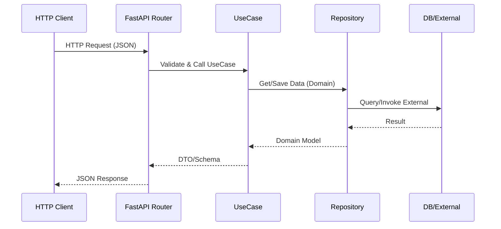

# 架构设计SOP（Python 3.11 Web）

## 目的
建立标准化的架构设计流程，确保 Web 系统架构清晰、可扩展、易维护、可观测与安全合规。

## 架构设计原则

### 1. 核心原则
- **SOLID原则**: 单一职责、开闭原则、里氏替换、接口隔离、依赖倒置
- **KISS原则**: Keep It Simple, Stupid - 保持简单
- **DRY原则**: Don't Repeat Yourself - 避免重复
- **YAGNI原则**: You Aren't Gonna Need It - 不要过度设计

### 2. Web特定原则
- **分层解耦**: Presentation（API/前端）、Application（用例）、Domain（领域）、Infrastructure（存储/网络）
- **契约优先**: OpenAPI 驱动接口设计与联调
- **可观测性**: 日志结构化、指标、分布式追踪（OTel）
- **配置外置**: 12-Factor（环境变量、不可变构建）
- **依赖注入**: 降低耦合、提升可测性（FastAPI Depends、手写容器或punq）

## 架构设计流程

### 1. 需求分析

#### 1.1 功能需求分析
```markdown
# 功能需求清单
- [ ] 核心功能模块划分
- [ ] 功能依赖关系梳理
- [ ] 数据流向分析
- [ ] 第三方服务集成需求
```

#### 1.2 非功能需求分析
```markdown
# 非功能需求评估表
| 需求类型 | 具体要求 | 架构影响 |
|---------|---------|---------|
| 性能 | 启动时间<3秒 | 懒加载、模块化 |
| 可扩展性 | 支持功能插件化 | 组件化架构 |
| 安全性 | 数据加密存储 | 安全层设计 |
| 可维护性 | 模块独立更新 | 模块解耦 |
```

### 2. 架构选型

#### 2.1 常见后端架构模式对比
| 架构 | 优点 | 缺点 | 适用场景 |
|------|------|------|---------|
| 单体（分层） | 简单、部署快 | 规模变大复杂 | 中小型服务、原型 |
| Clean/Hexagonal | 解耦强、可测性高 | 初期样板代码多 | 长期演进型项目 |
| 微服务 | 独立伸缩、边界清晰 | 运维复杂 | 大型系统、团队分工 |

#### 2.2 推荐：Clean Architecture（FastAPI 示例）
```
project/
├── app/
│   ├── presentation/              # API 层（FastAPI 路由/依赖注入）
│   │   ├── api/
│   │   │   ├── v1/
│   │   │   │   ├── stories.py    # 路由与入参/出参 Schema
│   │   │   │   └── users.py
│   │   └── deps.py                # 依赖注入与安全
│   ├── application/               # 用例（服务编排）
│   │   └── use_cases/
│   │       └── generate_story.py
│   ├── domain/                    # 领域模型与接口
│   │   ├── models.py
│   │   └── repositories.py        # 抽象仓库接口
│   └── infrastructure/            # 实现（DB/缓存/第三方）
│       ├── repositories/
│       │   └── story_repository_impl.py
│       ├── db/
│       │   ├── base.py            # SQLAlchemy/SQLModel
│       │   └── session.py
│       └── clients/               # 外部服务客户端
├── tests/
│   ├── unit/
│   ├── integration/
│   └── e2e/
├── pyproject.toml
└── README.md
```

### 3. 详细设计

#### 3.1 模块划分
```mermaid
graph TD
    A[Presentation(API/前端)] --> B[Application(UseCases)]
    B --> C[Domain(Models/Interfaces)]
    C --> D[Infrastructure(DB/Cache/Clients)]
    D --> E[Observability(Logs/Metrics/Trace)]
```

#### 3.2 数据流设计（API 请求链）


#### 3.3 技术栈选择（建议）
```yaml
runtime:
  language: python==3.11

backend:
  framework: fastapi
  server: uvicorn[standard]
  schema: pydantic v2
  db: sqlalchemy/sqlmodel or prisma
  cache: redis
  broker: rabbitmq/kafka (可选)
  auth: OAuth2/JWT

frontend:
  build: vite/next.js
  package_manager: pnpm

quality:
  lint: ruff
  format: black, isort
  types: mypy/pyright
  test: pytest, pytest-asyncio, httpx
  coverage: coverage.py (>= 80%)
  security: pip-audit, bandit
  contracts: openapi + schemathesis

observability:
  tracing: opentelemetry
  metrics: prometheus + grafana
  logging: structlog/loguru + json logs
```

### 4. 架构文档

#### 4.1 架构决策记录（ADR）
```markdown
# ADR-001: 使用 Clean Architecture + FastAPI

## 状态
已采纳

## 背景
需要一个可维护、可测试、可扩展的架构

## 决策
采用 Clean Architecture + FastAPI（路由薄、用例厚、仓库抽象）

## 理由
1. 清晰的分层，职责明确
2. 高可测试性
3. 独立于框架
4. 独立于框架（接口隔离）
5. 独立于数据库（仓库抽象）

## 后果
- 正面：代码结构清晰，易于维护
- 负面：初期开发成本较高，有学习曲线
```

#### 4.2 架构图
```
┌─────────────────────────────────────────────┐
│                Presentation                  │
│  ┌─────────┐  ┌──────────┐  ┌──────────┐  │
│  │Compose UI│  │ViewModel│  │Navigator │  │
│  └─────────┘  └──────────┘  └──────────┘  │
└─────────────────────────────────────────────┘
                      │
┌─────────────────────────────────────────────┐
│                  Domain                      │
│  ┌─────────┐  ┌──────────┐  ┌──────────┐  │
│  │ UseCase │  │  Model   │  │Repository│  │
│  └─────────┘  └──────────┘  │Interface │  │
└─────────────────────────────────────────────┘
                      │
┌─────────────────────────────────────────────┐
│                   Data                       │
│  ┌─────────┐  ┌──────────┐  ┌──────────┐  │
│  │  API    │  │  DB/Cache│  │Repository│  │
│  │ Router  │  │  Clients │  │   Impl   │  │
│  └─────────┘  └──────────┘  └──────────┘  │
└─────────────────────────────────────────────┘
```

### 5. 代码规范

#### 5.1 包结构
```
app/
├── presentation/
│   ├── api/
│   │   └── v1/
│   └── deps.py
├── application/
│   └── use_cases/
├── domain/
│   ├── models.py
│   └── repositories.py
└── infrastructure/
    ├── repositories/
    ├── db/
    └── clients/
```

#### 5.1.1 🔴 关键：架构层级注释规范

```python
class StoryRepositoryImpl(StoryRepository):
    """数据层 - 故事仓库实现（示例）。"""

    async def generate_story(self, topic: str) -> Story:
        # 调用外部服务 + 本地缓存 + 降级策略（省略实现）
        ...
```

#### 5.2 命名规范
```python
# 命名
class GenerateStoryUseCase: ...
class StoryRepository(Protocol): ...
class StoryRepositoryImpl(StoryRepository): ...

# 函数
async def generate_story(...) -> Story: ...
def save_story(story: Story) -> None: ...
```

### 6. 性能考虑

#### 6.1 启动优化
```text
延迟非关键初始化；单例化客户端；仅加载必要配置与依赖
```

#### 6.2 内存优化
```text
连接池与文件句柄关闭；限制缓存大小；避免持久引用大对象
```

### 7. 安全设计

#### 7.1 数据安全
```text
敏感信息加密存储；密钥由环境/密管注入；最小权限、审计与脱敏
```

## 架构评审

### 评审清单
- [ ] 是否满足所有功能需求？
- [ ] 是否考虑了扩展性？
- [ ] 模块间依赖是否合理？
- [ ] 是否有循环依赖？
- [ ] 性能瓶颈是否识别？
- [ ] 安全风险是否评估？
- [ ] 技术债务是否可控？

### 评审参与者
- 技术架构师（主导）
- 高级开发工程师
- 产品经理
- QA负责人

## 最佳实践

### DO ✅
1. **保持简单**: 先实现MVP，逐步演进
2. **模块化设计**: 高内聚低耦合
3. **依赖抽象**: 依赖接口而非实现
4. **统一规范**: 代码风格一致
5. **文档同步**: 架构变更及时更新文档

### DON'T ❌
1. **过度设计**: 不要为未来10年设计
2. **技术炫技**: 选择团队能驾驭的技术
3. **忽视债务**: 定期重构和优化
4. **固步自封**: 持续学习新技术
5. **独断专行**: 架构决策要团队共识

## 架构演进

### 演进策略
1. **渐进式重构**: 不要推倒重来
2. **A/B测试**: 新架构先小范围试点
3. **度量驱动**: 用数据验证架构改进
4. **向下兼容**: 保证平滑过渡

### 技术债务管理
```markdown
# 技术债务记录
| 债务描述 | 产生原因 | 影响范围 | 优先级 | 解决方案 |
|---------|---------|---------|--------|---------|
| 网络层未统一错误处理 | 快速开发 | 所有API调用 | 高 | 统一拦截器 |
| 部分模块耦合度高 | 需求变更 | 故事模块 | 中 | 重构解耦 |
```

---

*基于 Clean Architecture 的 Web 实践*  
*适用于中小型至中大型 Web 项目*