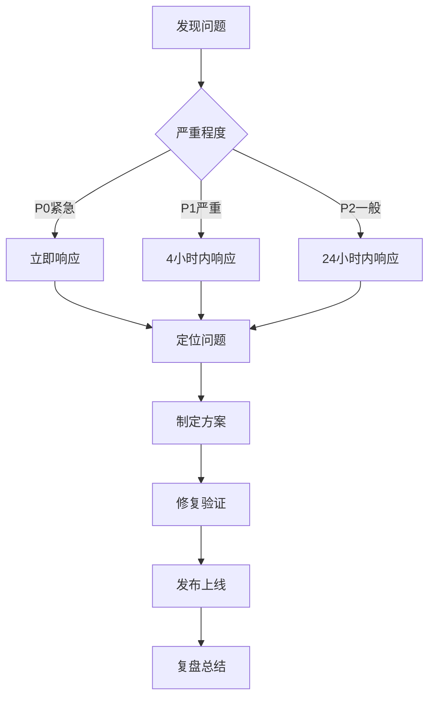

# 开发流程SOP（Python 3.11 Web）

## 目的
建立标准化的开发流程，确保代码质量、开发效率和团队协作顺畅。

## 开发流程概览


## 1. 开发准备

### 1.1 环境搭建
```bash
# 开发环境要求
- Python: 3.11.x
- Node.js: LTS（如涉及前端）
- 包管理: uv / poetry / pip
- 数据库: Postgres/MySQL/SQLite（按需）

# 项目初始化（uv 示例）
git clone https://github.com/company/project.git
cd project
uv sync  # 或 poetry install / pip install -r requirements.txt

# 运行（FastAPI 示例）
uvicorn app.presentation.api.main:app --reload
```

### 1.2 开发规范配置
```toml
# pyproject.toml（示例片段）
[tool.ruff]
line-length = 100
select = ["E","F","I","UP","B","C90"]
ignore = ["E203"]

[tool.black]
line-length = 100
target-version = ["py311"]

[tool.isort]
profile = "black"

[tool.mypy]
python_version = "3.11"
warn_unused_configs = true
disallow_untyped_defs = true
no_implicit_optional = true
strict_optional = true
```

### 1.3 分支管理
```bash
# 分支命名规范
main              # 主分支，生产代码
develop           # 开发分支
feature/xxx       # 功能分支
bugfix/xxx        # Bug修复分支
hotfix/xxx        # 紧急修复分支
release/x.x.x     # 发布分支

# 示例
feature/story-generation-api
bugfix/order-calc-precision
hotfix/rollback-login-issue
```

## 2. 需求理解

### 2.1 需求确认清单
- [ ] 阅读需求文档和原型
- [ ] 理解验收标准
- [ ] 确认技术可行性
- [ ] 评估工作量
- [ ] 识别依赖关系

### 2.2 技术方案设计（含API合同）
```markdown
# 技术方案模板

## 需求概述
简述需求背景和目标

## 技术方案
### 方案选择
- 方案A：优缺点分析
- 方案B：优缺点分析
- 推荐方案及理由

### 实现细节
- 涉及模块
- 数据流程
- 关键算法
- 第三方依赖

 ### API 合同（OpenAPI）
 - 新增/变更接口的路径、方法、入参/出参 Schema
 - 鉴权与权限（OAuth2/JWT/Session）
 - 错误码与错误体格式

### 工作量评估
- 开发：X人天
- 测试：X人天
- 总计：X人天

### 风险评估
- 技术风险及应对
- 进度风险及应对
```

## 3. 开发实现

### 3.1 任务拆分原则
```markdown
# INVEST原则
- Independent: 任务独立，可并行开发
- Negotiable: 可协商调整
- Valuable: 有业务价值
- Estimable: 可估算工作量
- Small: 足够小（1-3天完成）
- Testable: 可测试验证

# 任务拆分示例
故事生成功能：
├── API接口定义 (0.5天)
├── Repository实现 (1天)
├── UseCase实现 (0.5天)
├── ViewModel逻辑 (1天)
├── UI界面实现 (1天)
├── 单元测试 (1天)
└── 集成测试 (0.5天)
```

### 3.2 编码实践

#### 🔴 极其重要：中文注释是必需的，不是可选的！

> **为什么中文注释如此重要？**
> 1. **降低维护成本**：新人能快速理解业务逻辑
> 2. **减少沟通成本**：代码即文档，减少反复询问
> 3. **提高开发效率**：二次开发时能快速定位和修改
> 4. **保证功能正确**：清晰的注释避免理解偏差导致的bug
> 5. **知识传承**：即使人员变动，业务知识得以保留

#### 必须添加注释的场景
1. **复杂业务逻辑**：超过3行的业务处理
2. **算法实现**：任何算法都要说明思路
3. **交互流程**：UI交互的完整流程
4. **异常处理**：为什么这样处理异常
5. **性能优化**：优化的原因和效果
6. **临时方案**：为什么采用临时方案

#### Clean Architecture（FastAPI + Pydantic 示例，含 Docstring）
```python
from pydantic import BaseModel, Field


class Story(BaseModel):
    """领域模型：AI 生成的儿童故事。

    字段:
      - id: 唯一标识
      - title: 标题
      - content: 正文（300-500字）
      - questions: 理解题列表
    """

    id: str
    title: str
    content: str
    questions: list[str] = Field(default_factory=list)


class StoryRepository:
    """仓库接口：定义故事相关数据操作。"""

    async def generate(self, topic: str) -> Story:  # pragma: no cover (interface)
        raise NotImplementedError


class GenerateStoryUseCase:
    """用例：根据主题生成故事。

    规则：
      - topic 必须非空
      - 失败需抛出领域错误或返回可恢复结果
    """

    def __init__(self, repo: StoryRepository) -> None:
        self._repo = repo

    async def __call__(self, topic: str) -> Story:
        if not topic.strip():
            raise ValueError("主题不能为空")
        return await self._repo.generate(topic)
```

#### 错误处理最佳实践（统一异常与错误体）
```python
from fastapi import HTTPException


class AppError(Exception):
    pass


class NetworkError(AppError):
    pass


class ServerError(AppError):
    def __init__(self, code: int, message: str) -> None:
        super().__init__(message)
        self.code = code


def to_http_exception(error: AppError) -> HTTPException:
    if isinstance(error, NetworkError):
        return HTTPException(status_code=503, detail="网络不可用，请稍后再试")
    if isinstance(error, ServerError):
        return HTTPException(status_code=502, detail=f"服务器错误({error.code})")
    return HTTPException(status_code=500, detail="服务异常，请稍后再试")
```

### 3.3 测试驱动开发（TDD）

#### 单元测试示例
```python
import pytest


class FakeRepo:
    async def generate(self, topic: str):
        from app.domain.models import Story  # 示例导入
        return Story(id="1", title=f"关于{topic}", content="...", questions=[])


@pytest.mark.asyncio
async def test_generate_story_use_case():
    from app.application.use_cases.generate_story import GenerateStoryUseCase

    use_case = GenerateStoryUseCase(FakeRepo())
    story = await use_case("恐龙")
    assert story.title
    assert story.content
```

### 3.4 调试技巧

#### 日志规范
```text
- 使用结构化日志（JSON），输出请求ID/TraceID、方法、路径、耗时、状态码
- 生产环境降低日志级别并避免敏感数据
- 统一日志格式，便于集中检索与分析（ELK/Datadog/Cloud Logging）
```

#### 调试工具
```text
- API 调试：Swagger UI / ReDoc / Postman / httpx
- 压测：k6 / locust
- 观测：OpenTelemetry（Trace/Metrics）+ Prometheus + Grafana
```

## 4. 代码提交

### 4.1 提交前检查
```bash
# 格式/静态/类型/测试/覆盖率
ruff .
black --check . && isort --check-only .
mypy .
pytest -q --maxfail=1 --disable-warnings
coverage run -m pytest && coverage report --fail-under=80

# 依赖与安全
pip-audit -P || true
bandit -q -r app || true
```

### 4.2 提交规范
```bash
# Commit Message格式
<type>(<scope>): <subject>

<body>

<footer>

# type类型
feat: 新功能
fix: 修复bug
docs: 文档更新
style: 代码格式调整
refactor: 重构
test: 测试相关
chore: 构建或辅助工具变动

# 示例
feat(story): 添加故事生成功能

- 实现故事生成API调用
- 添加本地缓存机制
- 支持离线故事展示

Closes #123
```

### 4.3 Pull Request规范
```markdown
## 描述
简要说明这个PR的目的和改动内容

## 改动类型
- [ ] Bug修复
- [x] 新功能
- [ ] 代码重构
- [ ] 文档更新

## 改动内容
- 添加了故事生成功能
- 实现了错误处理和重试机制
- 添加了相关单元测试

## 测试
- [x] 本地测试通过
- [x] 添加了新的测试用例
- [x] 现有测试未受影响

## 截图（如果涉及UI改动）
[添加截图]

## 相关Issue
Closes #123
```

## 5. 持续集成

### 5.1 CI配置
```yaml
name: Web CI

on:
  push:
    branches: [ main, develop ]
  pull_request:
    branches: [ main, develop ]

jobs:
  test:
    runs-on: ubuntu-latest
    steps:
    - uses: actions/checkout@v3
    - uses: actions/setup-python@v5
      with:
        python-version: '3.11'

    - name: Install UV
      run: pip install uv

    - name: Sync deps
      run: uv sync

    - name: Lint & Type Check
      run: |
        uv run ruff .
        uv run black --check .
        uv run isort --check-only .
        uv run mypy .

    - name: Tests & Coverage
      run: |
        uv run coverage run -m pytest -q
        uv run coverage report --fail-under=80

    - name: Security
      run: |
        uv run pip-audit -P || true
        uv run bandit -q -r app || true
```

### 5.2 代码质量门禁
```text
- 覆盖率 ≥ 80%
- ruff 无高优先级问题
- mypy 严格模式通过（或风险说明）
- pip-audit 无高危依赖（或说明与隔离）
```

## 6. 最佳实践

### DO ✅
1. **小步提交**: 频繁提交，每次改动不要太大
2. **写好测试**: TDD开发，先写测试再写代码
3. **及时重构**: 发现问题立即重构
4. **代码审查**: 认真review他人代码
5. **持续学习**: 学习新技术和最佳实践

### DON'T ❌
1. **大量改动**: 避免一次提交几千行
2. **忽视警告**: 不要忽视编译器警告
3. **复制粘贴**: 避免重复代码
4. **过早优化**: 先实现功能再优化
5. **单打独斗**: 遇到问题及时沟通

## 7. 故障处理

### 7.1 线上问题处理流程


### 7.2 问题定位技巧
1. **查看日志**: Crashlytics、服务器日志
2. **复现问题**: 相同环境和步骤
3. **二分法**: 缩小问题范围
4. **对比分析**: 与正常情况对比
5. **工具辅助**: 使用调试工具

---

*面向Python 3.11 Web开发实践*  
*强调代码质量与可观测性*