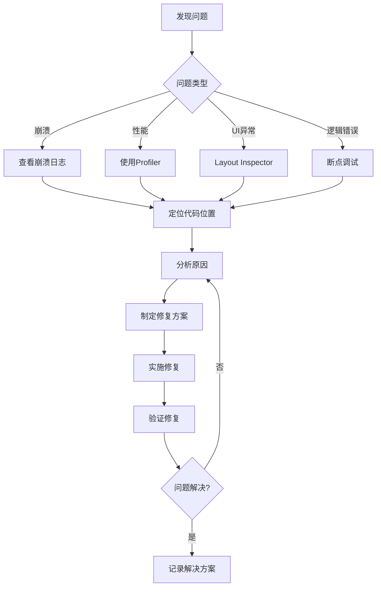

# 调试与问题修复SOP（Python 3.11 Web）

## 目的
提供系统化的调试方法和常见问题的修复方案，帮助开发者快速定位和解决问题。

## 1. 调试工具箱

### 1.1 基础调试工具配置
```text
- 日志：structlog/loguru，输出 JSON，包含 request_id/trace_id
- 本地：uvicorn --reload 打印栈与请求日志
- APM：OpenTelemetry + Exporter（Jaeger/Tempo/Datadog）
```

### 1.2 网络调试配置
```python
import httpx


async def traced_get(url: str) -> dict:
    async with httpx.AsyncClient(timeout=30.0) as client:
        r = await client.get(url)
        r.raise_for_status()
        return r.json()
```

## 2. 常见问题诊断与修复

### 2.1 异常与全局错误处理
```python
from fastapi import FastAPI, Request
from fastapi.responses import JSONResponse


app = FastAPI()


@app.exception_handler(Exception)
async def global_exception_handler(_: Request, exc: Exception):
    # TODO: 记录结构化日志，包含 trace_id、path、method
    return JSONResponse(status_code=500, content={"detail": "服务异常，请稍后再试"})
```

### 2.2 资源泄漏排查
```text
- 连接/会话：数据库、Redis、HTTP 客户端需集中管理并在应用生命周期内复用
- 文件句柄：上传/下载/流式处理确保 finally/async with 关闭
- 子进程/线程：避免孤儿进程与线程池耗尽，设置超时与回收
```

### 2.3 卡顿/阻塞
```text
- 异步端点避免阻塞式 requests/IO
- 数据库慢查询：开启 SQL 日志与分析索引
- 外部依赖慢：增加超时与重试/熔断
```

### 2.4 前端联调（如适用）
```text
- CORS 与本地代理：确保跨域策略与开发代理正确配置
- 浏览器 DevTools：Network/Performance/Console 分析请求与渲染
- Source Map：断点与错误定位；统一错误上报（Sentry/前端 SDK）
```

## 3. 性能问题诊断

### 3.1 启动性能优化
```text
# 启动性能记录（示例：用 logging/metrics 记录阶段耗时）
```

### 3.2 列表性能优化
```text
# 列表/渲染性能优化（前端）：虚拟列表、memo、避免重复创建
```

## 4. 调试工作流程

### 4.1 问题定位流程


### 4.2 调试检查清单
```text
# 调试步骤：收集（日志/trace/请求）、定位（断点/二分）、验证（回归/性能）
```

### 4.3 调试日志最佳实践
```text
# 结构化日志建议：level/ts/request_id/path/status/duration；敏感信息脱敏
```

## 5. 生产环境问题排查

### 5.1 远程日志收集
```text
# 远程日志：集中收集与检索；严重级别即时报警
```

### 5.2 用户反馈系统
```text
# 用户反馈：前端埋点/表单收集，附带浏览器与环境信息
```

## 最佳实践总结

### DO ✅
1. **预防胜于治疗**：编写防御性代码
2. **日志要有结构**：使用统一的日志格式
3. **保留现场**：崩溃时收集完整信息
4. **逐步缩小范围**：使用二分法定位问题
5. **记录解决方案**：相同问题不要重复踩坑

### DON'T ❌
1. **忽视警告**：编译警告往往是问题前兆
2. **过度日志**：生产环境避免敏感信息
3. **修改不测试**：每次修复都要验证
4. **依赖猜测**：用数据和日志说话
5. **独自奋战**：复杂问题要团队协作

---

*调试与问题修复SOP v1.0*  
*让调试成为一种享受而非折磨*