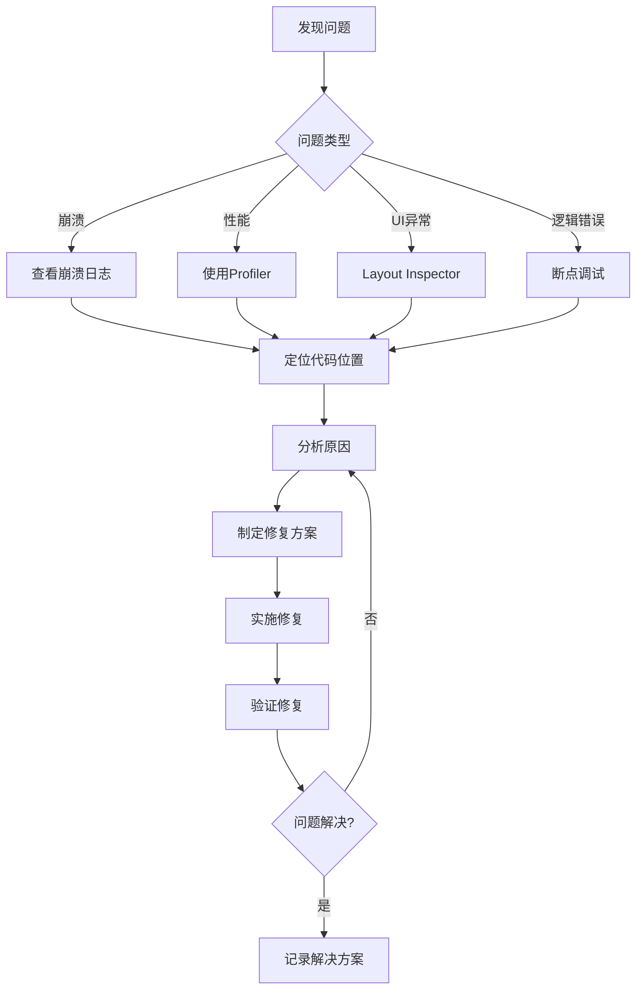

# 调试与问题修复SOP（Python 3.11 Web）

## 目的
提供系统化的调试方法和常见问题的修复方案，帮助开发者快速定位和解决问题。

## 1. 调试工具箱

### 1.1 基础调试工具配置
```text
- 日志：structlog/loguru，输出 JSON，包含 request_id/trace_id
- 本地：uvicorn --reload 打印栈与请求日志
- APM：OpenTelemetry + Exporter（Jaeger/Tempo/Datadog）
```

### 1.2 网络调试配置
```python
import httpx


async def traced_get(url: str) -> dict:
    async with httpx.AsyncClient(timeout=30.0) as client:
        r = await client.get(url)
        r.raise_for_status()
        return r.json()
```

## 2. 常见问题诊断与修复

### 2.1 异常与全局错误处理
```python
from fastapi import FastAPI, Request
from fastapi.responses import JSONResponse


app = FastAPI()


@app.exception_handler(Exception)
async def global_exception_handler(_: Request, exc: Exception):
    # TODO: 记录结构化日志，包含 trace_id、path、method
    return JSONResponse(status_code=500, content={"detail": "服务异常，请稍后再试"})
```

### 2.2 资源泄漏排查
```text
- 连接/会话：数据库、Redis、HTTP 客户端需集中管理并在应用生命周期内复用
- 文件句柄：上传/下载/流式处理确保 finally/async with 关闭
- 子进程/线程：避免孤儿进程与线程池耗尽，设置超时与回收
```

### 2.3 卡顿/阻塞
```text
- 异步端点避免阻塞式 requests/IO
- 数据库慢查询：开启 SQL 日志与分析索引
- 外部依赖慢：增加超时与重试/熔断
```

### 2.4 前端联调（如适用）
```text
- CORS 与本地代理：确保跨域策略与开发代理正确配置
- 浏览器 DevTools：Network/Performance/Console 分析请求与渲染
- Source Map：断点与错误定位；统一错误上报（Sentry/前端 SDK）
```

## 3. 性能问题诊断

### 3.1 启动性能优化
```kotlin
/**
 * 应用启动时间分析与优化
 */

// 1. 启动时间测量
class StartupTimer {
    companion object {
        private var startTime = 0L
        private val measurements = mutableMapOf<String, Long>()
        
        fun start() {
            startTime = System.currentTimeMillis()
        }
        
        fun measure(phase: String) {
            val duration = System.currentTimeMillis() - startTime
            measurements[phase] = duration
            Timber.d("⏱️ 启动耗时 - $phase: ${duration}ms")
        }
        
        fun report() {
            Timber.d("=== 启动性能报告 ===")
            measurements.forEach { (phase, duration) ->
                Timber.d("$phase: ${duration}ms")
            }
            val total = System.currentTimeMillis() - startTime
            Timber.d("总耗时: ${total}ms")
        }
    }
}

// 2. Application优化
class EnlightenmentApp : Application() {
    override fun attachBaseContext(base: Context) {
        super.attachBaseContext(base)
        StartupTimer.start()
    }
    
    override fun onCreate() {
        super.onCreate()
        
        // 必要的初始化
        initCriticalComponents()
        StartupTimer.measure("关键组件初始化")
        
        // 延迟初始化非关键组件
        Handler(Looper.getMainLooper()).post {
            initNonCriticalComponents()
            StartupTimer.measure("非关键组件初始化")
        }
    }
    
    private fun initCriticalComponents() {
        // 只初始化启动必需的组件
        Timber.plant(Timber.DebugTree())
    }
    
    private fun initNonCriticalComponents() {
        // 延迟初始化
        // - 分析工具
        // - 广告SDK
        // - 其他第三方库
    }
}
```

### 3.2 列表性能优化
```kotlin
/**
 * RecyclerView/LazyColumn性能问题诊断
 */

// 1. Compose LazyColumn优化
@Composable
fun OptimizedList(items: List<Item>) {
    LazyColumn {
        items(
            items = items,
            key = { it.id },  // 使用稳定的key
            contentType = { it.type }  // 指定内容类型
        ) { item ->
            // 使用remember避免重复创建
            val processedData = remember(item.id) {
                processItemData(item)
            }
            
            ItemCard(processedData)
        }
    }
}

// 2. 图片加载优化
@Composable
fun OptimizedImage(url: String) {
    AsyncImage(
        model = ImageRequest.Builder(LocalContext.current)
            .data(url)
            .crossfade(true)
            .memoryCachePolicy(CachePolicy.ENABLED)
            .diskCachePolicy(CachePolicy.ENABLED)
            .size(Size.ORIGINAL)  // 指定大小避免过度解码
            .build(),
        contentDescription = null,
        modifier = Modifier.fillMaxWidth()
    )
}
```

## 4. 调试工作流程

### 4.1 问题定位流程


### 4.2 调试检查清单
```kotlin
/**
 * 系统化的调试步骤
 * 
 * 1. 复现问题
 *    □ 记录复现步骤
 *    □ 确定问题发生条件
 *    □ 收集设备信息
 * 
 * 2. 收集信息
 *    □ 查看Logcat日志
 *    □ 获取崩溃堆栈
 *    □ 检查网络请求
 *    □ 分析内存使用
 * 
 * 3. 定位原因
 *    □ 使用断点调试
 *    □ 添加日志输出
 *    □ 二分法缩小范围
 *    □ 对比正常情况
 * 
 * 4. 验证修复
 *    □ 问题不再复现
 *    □ 没有引入新问题
 *    □ 性能没有退化
 *    □ 添加防护测试
 */
```

### 4.3 调试日志最佳实践
```kotlin
/**
 * 结构化的调试日志
 */
object DebugLogger {
    
    // 使用emoji让日志更清晰
    fun logApiCall(method: String, url: String) {
        Timber.d("🌐 API调用: $method $url")
    }
    
    fun logUserAction(action: String, details: Map<String, Any>? = null) {
        Timber.d("👆 用户操作: $action ${details?.let { "- $it" } ?: ""}")
    }
    
    fun logStateChange(component: String, oldState: Any?, newState: Any?) {
        Timber.d("🔄 状态变更 [$component]: $oldState → $newState")
    }
    
    fun logPerformance(operation: String, duration: Long) {
        val emoji = when {
            duration < 100 -> "🚀"
            duration < 500 -> "✅"
            duration < 1000 -> "⚠️"
            else -> "🐌"
        }
        Timber.d("$emoji 性能 [$operation]: ${duration}ms")
    }
    
    fun logError(error: Throwable, context: String) {
        Timber.e(error, "❌ 错误 [$context]")
    }
}

// 使用示例
class StoryViewModel : ViewModel() {
    fun loadStory(id: String) {
        DebugLogger.logUserAction("加载故事", mapOf("id" to id))
        
        viewModelScope.launch {
            try {
                val startTime = System.currentTimeMillis()
                val story = repository.getStory(id)
                val duration = System.currentTimeMillis() - startTime
                
                DebugLogger.logPerformance("加载故事", duration)
                DebugLogger.logStateChange("StoryScreen", "Loading", "Success")
                
            } catch (e: Exception) {
                DebugLogger.logError(e, "加载故事失败")
            }
        }
    }
}
```

## 5. 生产环境问题排查

### 5.1 远程日志收集
```kotlin
/**
 * 生产环境日志收集方案
 */
class RemoteLogger {
    
    private val logBuffer = mutableListOf<LogEntry>()
    private val maxBufferSize = 100
    
    data class LogEntry(
        val timestamp: Long,
        val level: String,
        val tag: String,
        val message: String,
        val extra: Map<String, Any>? = null
    )
    
    fun log(level: String, tag: String, message: String, extra: Map<String, Any>? = null) {
        val entry = LogEntry(
            timestamp = System.currentTimeMillis(),
            level = level,
            tag = tag,
            message = message,
            extra = extra
        )
        
        synchronized(logBuffer) {
            logBuffer.add(entry)
            if (logBuffer.size > maxBufferSize) {
                logBuffer.removeAt(0)
            }
        }
        
        // 严重错误立即上报
        if (level == "ERROR" || level == "FATAL") {
            uploadLogs()
        }
    }
    
    fun uploadLogs() {
        val logsToUpload = synchronized(logBuffer) {
            logBuffer.toList().also { logBuffer.clear() }
        }
        
        // 上传到服务器
        // api.uploadLogs(logsToUpload)
    }
}
```

### 5.2 用户反馈系统
```kotlin
/**
 * 应用内反馈收集
 */
@Composable
fun FeedbackDialog(
    onDismiss: () -> Unit,
    onSubmit: (String, List<Uri>) -> Unit
) {
    var feedback by remember { mutableStateOf("") }
    var screenshots by remember { mutableStateOf<List<Uri>>(emptyList()) }
    
    AlertDialog(
        onDismissRequest = onDismiss,
        title = { Text("遇到问题了吗？") },
        text = {
            Column {
                OutlinedTextField(
                    value = feedback,
                    onValueChange = { feedback = it },
                    label = { Text("请描述您遇到的问题") },
                    modifier = Modifier.fillMaxWidth()
                )
                
                // 截图附件
                Row {
                    TextButton(onClick = { /* 添加截图 */ }) {
                        Icon(Icons.Default.Image, null)
                        Text("添加截图")
                    }
                }
            }
        },
        confirmButton = {
            TextButton(
                onClick = {
                    // 收集设备信息
                    val deviceInfo = buildString {
                        appendLine("设备: ${Build.MODEL}")
                        appendLine("系统: Android ${Build.VERSION.RELEASE}")
                        appendLine("应用版本: ${BuildConfig.VERSION_NAME}")
                    }
                    
                    // 提交反馈
                    onSubmit(
                        "$feedback\n\n--- 设备信息 ---\n$deviceInfo",
                        screenshots
                    )
                }
            ) {
                Text("提交")
            }
        },
        dismissButton = {
            TextButton(onClick = onDismiss) {
                Text("取消")
            }
        }
    )
}
```

## 最佳实践总结

### DO ✅
1. **预防胜于治疗**：编写防御性代码
2. **日志要有结构**：使用统一的日志格式
3. **保留现场**：崩溃时收集完整信息
4. **逐步缩小范围**：使用二分法定位问题
5. **记录解决方案**：相同问题不要重复踩坑

### DON'T ❌
1. **忽视警告**：编译警告往往是问题前兆
2. **过度日志**：生产环境避免敏感信息
3. **修改不测试**：每次修复都要验证
4. **依赖猜测**：用数据和日志说话
5. **独自奋战**：复杂问题要团队协作

---

*调试与问题修复SOP v1.0*  
*让调试成为一种享受而非折磨*