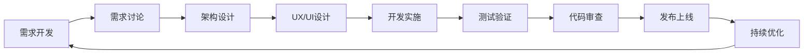

# Python 3.11 Web 项目标准操作程序（SOP）

## 概述

本目录包含基于团队最佳实践总结的 Python 3.11 Web 项目全流程 SOP，涵盖从需求到交付的完整生命周期，适用于 FastAPI/Django/Flask 等主流后端框架与现代前端栈（React/Vue/Svelte 等）。

## 目录结构

```
sop/
├── README.md                           # 本文档
├── 01-requirements-development.md      # 需求开发SOP
├── 02-requirements-discussion.md       # 需求讨论SOP
├── 03-architecture-design.md           # 架构设计SOP（后端/前端）
├── 04-ux-ui-design.md                  # Web UX/UI设计SOP
├── 05-development-process.md           # 开发流程SOP（Python/前端协同）
├── 06-code-review.md                   # 代码审查SOP（PEP8/Type hints/安全）
├── 07-testing-strategy.md              # 测试策略SOP（pytest/coverage/Playwright）
├── 08-release-process.md               # 发布流程SOP（Docker/K8s/灰度/回滚）
├── 09-comment-standards.md             # 🔴 Docstring与中文注释规范【极其重要】
├── 10-dev-environment-guide.md         # 开发环境与工具指南（Python/Web）
├── 11-debugging-troubleshooting.md     # 调试与问题修复指南（后端/前端）
└── 12-feature-navigation-guide.md      # 路由与功能入口快速定位（API/前端路由）
```

## 开发流程概览



## 核心原则

### 🔴 0. 代码必须有高质量 Docstring 与中文注释【最高优先级】
- **所有类都必须有完整的功能说明**
- **复杂方法都必须有详细的流程注释**
- **业务逻辑都必须有清晰的解释**
- **交互流程都必须有步骤说明**
- **为二次开发提供充分的指导**
- 详见：[中文注释规范](./09-comment-standards.md)

### 1. 用户价值优先
- 每个功能都要有明确的用户价值
- 优先解决用户痛点
- 持续收集用户反馈

### 2. 迭代开发
- 小步快跑，快速验证
- MVP先行，逐步完善
- 每个迭代都可交付

### 3. 质量内建
- 代码质量从开发开始（PEP8/PEP257、类型注解）
- 测试左移（pytest/pytest-asyncio、contract test、schema 校验）
- 持续集成（ruff/mypy/pytest/coverage/安全扫描）

### 4. 团队协作
- 跨职能团队紧密合作
- 信息透明，及时沟通
- 知识共享，共同成长

## 关键指标

### 开发效率
- 需求交付周期：2-4周
- 代码审查时间：< 24小时
- Bug修复时间：P0 < 4小时，P1 < 24小时

### 质量标准
- 代码覆盖率：> 80%
- Pydantic/Schema 校验全覆盖关键输入输出
- 性能：P95 API 延迟达标（如 < 200ms，视服务而定）
- 前端体验（Web Vitals）：LCP < 2.5s、FID < 100ms、CLS < 0.1（关键页面）
- 安全：依赖与镜像安全扫描零高危（pip-audit/trivy）

### 用户满意度（Web）
- 可用性：SLA、错误率、P95 延迟
- 体验：核心转化/完成率 > 80%
- 可访问性：WCAG 对齐（关键页面 AA）

## 快速开始

1. **新项目启动**
   - 使用[需求文档模板](./templates/requirements-template.md)
   - 定义[API 合同（OpenAPI）](./templates/api-contract-template.md)
   - 参考[架构设计SOP](./03-architecture-design.md)
   - 遵循[开发流程SOP](./05-development-process.md)
   - 配置[开发环境（Python/Web）](./10-dev-environment-guide.md)

2. **日常开发**
   - 查看[开发检查清单](./checklists/development-checklist.md)
   - 使用[功能定位指南（API/路由/服务）](./12-feature-navigation-guide.md)
   - 参考[调试指南](./11-debugging-troubleshooting.md)
   - 执行[代码审查SOP](./06-code-review.md)
   - 运行安全与质量校验（ruff/mypy/pytest/coverage/pip-audit）

3. **版本发布**
   - 遵循[发布流程SOP](./08-release-process.md)
   - 完成[发布检查清单](./checklists/release-checklist.md)
   - 构建与发布镜像（Docker），部署（K8s/Serverless/VM）
   - 灰度与回滚策略、观测（APM/Logs/Metrics/Tracing）

4. **问题处理**
   - 查看[调试与修复指南](./11-debugging-troubleshooting.md)
   - 使用 Web 调试工具（uvicorn/fastapi 调试、浏览器 devtools、APM）
   - 记录解决方案与运行手册

## 最佳实践

### DO ✅
1. 始终从用户需求出发
2. 保持代码简洁可维护
3. 重视团队协作和沟通
4. 持续学习和改进
5. 自动化重复性工作

### DON'T ❌
1. 过度设计和过早优化
2. 忽视技术债务累积
3. 跳过测试和代码审查
4. 闭门造车不听反馈
5. 追求完美延误交付

## 工具推荐

### 开发工具（建议）
- IDE: VS Code / PyCharm
- 版本控制: Git + GitHub/GitLab
- 包管理: uv/poetry/pip + requirements.txt/pyproject.toml
- 运行与热重载: uvicorn/fastapi CLI
- API 合同: OpenAPI/Swagger + schemathesis（合同测试）
- 前端：Node.js LTS + pnpm/npm + Vite/Next.js

### 协作工具
- 需求管理: Jira / Trello
- 设计协作: Figma / Sketch
- 文档管理: Confluence / Notion

### 质量与安全工具
- 代码质量: ruff / black / isort / mypy
- 测试: pytest / pytest-asyncio / coverage.py
- 合同测试: schemathesis / prance
- 安全: pip-audit / bandit / trivy（镜像）
- 观测: OpenTelemetry / Prometheus / Grafana / Sentry

---

*SOP版本：2.0（Web）*  
*面向 Python 3.11 Web 项目*  
*最后更新：2025年*