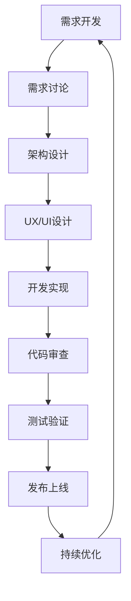

# Web 项目开发SOP总结（Python 3.11）

## 概述

本SOP体系面向 Python 3.11 Web 应用的完整生命周期，从需求到发布的每个关键环节，涵盖后端服务（FastAPI/Django/Flask 等）与现代前端协作。

## 核心价值观

### 🔴 0. Docstring 与中文注释是必需品，不是奢侈品
- **中文注释是强制要求，不是可选项**
- **Docstring（PEP257）+ 类型标注（PEP484/PEP561）为基础规范**
- **好的注释减少沟通成本并提升可维护性**
- 详见：[注释规范](./09-comment-standards.md)

### 1. 用户第一
- 每个决策都从用户价值出发
- 快速响应用户反馈
- 持续优化用户体验

### 2. 质量内建
- 质量不是测试出来的，是设计和开发出来的
- ruff/mypy/pytest/coverage 与合同测试前置
- 预防胜于修复

### 3. 持续改进
- 敏捷迭代，小步快跑
- 定期复盘，总结经验
- 拥抱变化，持续学习

### 4. 高效协作
- 信息透明，及时沟通
- 职责明确，相互支持
- 知识共享，共同成长

## SOP体系结构

## 关键实践总结

### 1. 需求阶段
- **用户故事格式化**：统一的需求描述方式
- **MoSCoW优先级**：科学的优先级管理
- **原型驱动**：可视化需求，减少理解偏差
- **🔴 注释要求明确**：需求文档中明确注释规范

### 2. 设计阶段
- **Clean Architecture**：清晰的分层架构
- **MVVM模式**：UI与业务逻辑分离
- **设计系统**：统一的视觉和交互规范
- **🔴 架构注释完整**：每层职责都有详细说明

### 3. 开发阶段
- **TDD/ATDD**：测试驱动与契约驱动
- **代码审查**：风格（PEP8）、类型（mypy）、复杂度（ruff）
- **持续集成**：自动化质量与安全检查
- **🔴 注释规范**：Docstring + 中文业务注释
- **调试能力**：API 与前端联调、APM、日志追踪
- **功能导航**：API 路由、服务/模块边界清晰

### 4. 发布阶段
- **容器化**：Docker 镜像最小化、SBOM、签名
- **灰度发布**：K8s 分批/金丝雀/蓝绿
- **实时监控**：APM/Logs/Metrics/Tracing
- **复盘改进**：事故复盘与行动项跟踪
- **文档同步更新**：OpenAPI、运行手册、环境变量清单

## 工具链推荐

### 开发工具
| 类别 | 工具 | 用途 |
|------|------|------|
| IDE | VS Code / PyCharm | 开发环境 |
| 版本控制 | Git + GitHub | 代码管理 |
| 后端 | FastAPI / Django / Flask | Web 框架 |
| 包管理 | uv / poetry / pip | 依赖与环境 |
| API 合同 | OpenAPI / Swagger | 合同与文档 |
| 前端 | React / Vue / Svelte | Web UI |

### 协作工具
| 类别 | 工具 | 用途 |
|------|------|------|
| 项目管理 | Jira/Trello | 任务跟踪 |
| 设计协作 | Figma | UI/UX设计 |
| 文档管理 | Confluence/Notion | 知识库 |
| 沟通工具 | Slack/飞书 | 团队沟通 |

### 质量工具
| 类别 | 工具 | 用途 |
|------|------|------|
| 风格/静态 | ruff, black, isort | 代码质量 |
| 类型检查 | mypy, pyright | 类型正确性 |
| 测试 | pytest, pytest-asyncio | 自动化测试 |
| 覆盖率 | coverage.py | 测试覆盖度 |
| 安全 | pip-audit, bandit, trivy | 依赖/镜像安全 |
| 合同测试 | schemathesis | API 契约测试 |

## 度量指标体系

### 效率指标
- **需求交付周期**：从需求到上线的时间
- **缺陷逃逸率**：生产发现缺陷比例
- **代码审查效率**：PR 审查完成时间

### 质量指标
- **代码覆盖率**：单元覆盖率 > 80%
- **P95 延迟/错误率**：达标
- **技术债务**：< 5%

### 用户指标
- **满意度/评分**：> 4.5（如前端应用）
- **性能体验**：P95 延迟达标
- **留存/转化**：核心路径达标

## 常见陷阱和解决方案

### 1. 需求频繁变更
**问题**：需求不断变化，影响开发进度  
**解决**：
- 设立需求冻结期
- 采用敏捷迭代，拥抱变化
- 加强需求评审，减少理解偏差

### 2. 技术债务累积
**问题**：只顾功能开发，忽视代码质量  
**解决**：
- 定期技术债务清理
- 代码审查严格把关
- 重构作为日常工作的一部分

### 3. 测试覆盖不足
**问题**：测试编写滞后，质量无保障  
**解决**：
- TDD开发模式
- 测试作为完成定义的一部分
- 自动化测试投入

### 4. 发布风险高
**问题**：一次性全量发布，问题影响大  
**解决**：
- 灰度发布策略
- 完善的监控体系
- 快速回滚机制

## 持续改进建议

### 短期改进（1-3个月）
1. **完善文档体系**：保持文档与代码同步
2. **提升自动化水平**：更多自动化测试和部署
3. **加强团队培训**：新技术和最佳实践分享

### 中期改进（3-6个月）
1. **优化开发流程**：识别瓶颈，持续优化
2. **建立技术雷达**：跟踪和评估新技术
3. **深化质量文化**：质量成为每个人的责任

### 长期改进（6-12个月）
1. **平台化建设**：通用组件和服务抽取
2. **智能化运维**：自动化监控和预警
3. **创新探索**：新技术和新模式尝试

## 成功案例

### AI启蒙时光项目成果
- **开发效率**：20周完成从0到1
- **代码质量**：95%以上完成度
- **用户体验**：适合3-6岁儿童的友好设计
- **技术创新**：AI驱动的个性化教育

### 关键成功因素
1. **清晰的架构设计**：Clean Architecture + MVVM
2. **完善的测试策略**：70%单元测试 + 20%集成测试 + 10%E2E测试
3. **严格的代码审查**：每个PR都经过review
4. **渐进式发布**：灰度发布降低风险

## 结语

这套SOP不是教条，而是最佳实践的总结。应根据团队与业务实际调整；重要的是建立适合自己的工作流程，并持续改进。

记住：
- **过程服务于结果**：不要为了流程而流程
- **实践出真知**：在实践中验证和改进
- **团队大于流程**：好的团队比好的流程更重要

祝您的 Web 项目开发顺利！🚀

---

*面向 Python 3.11 Web 项目*  
*版本：2.0*  
*更新时间：2025年*